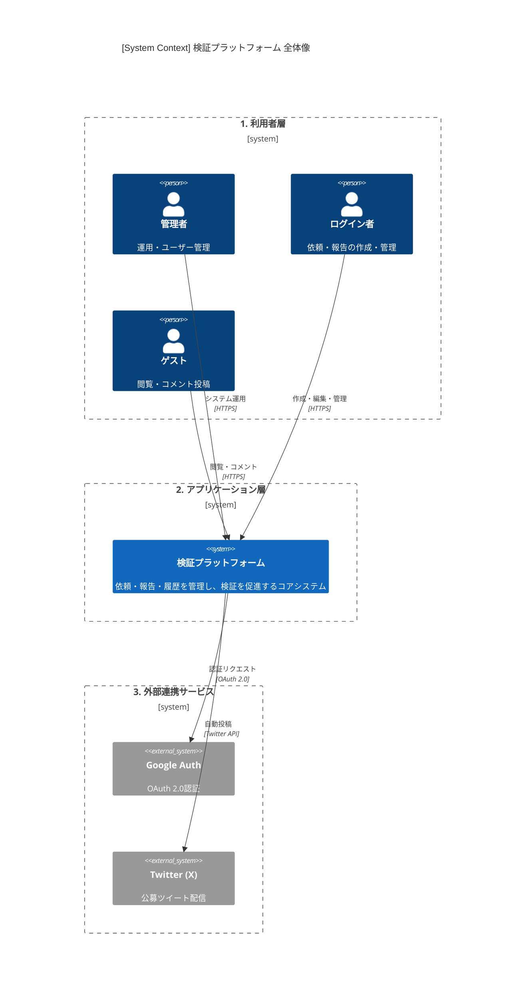
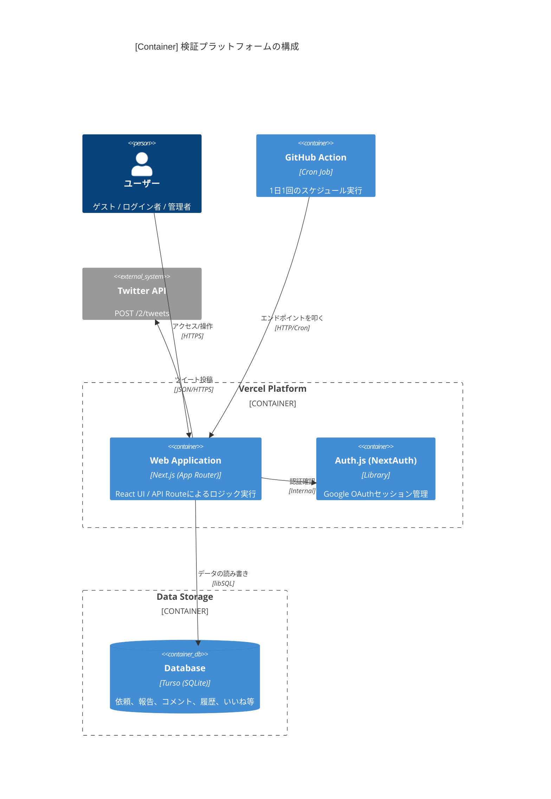
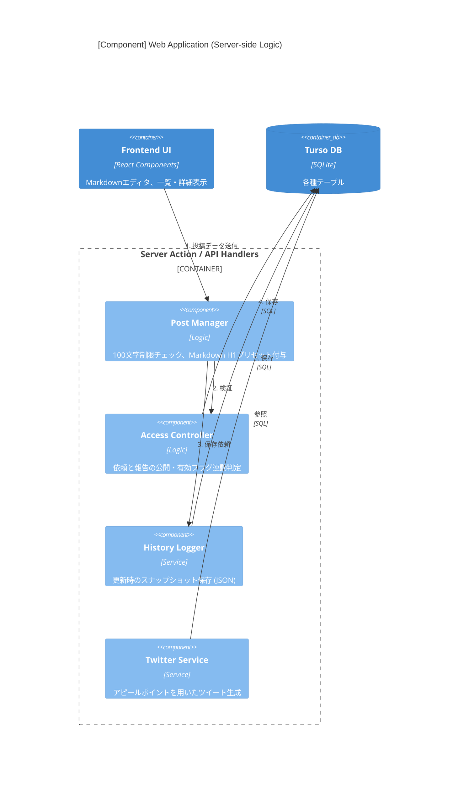
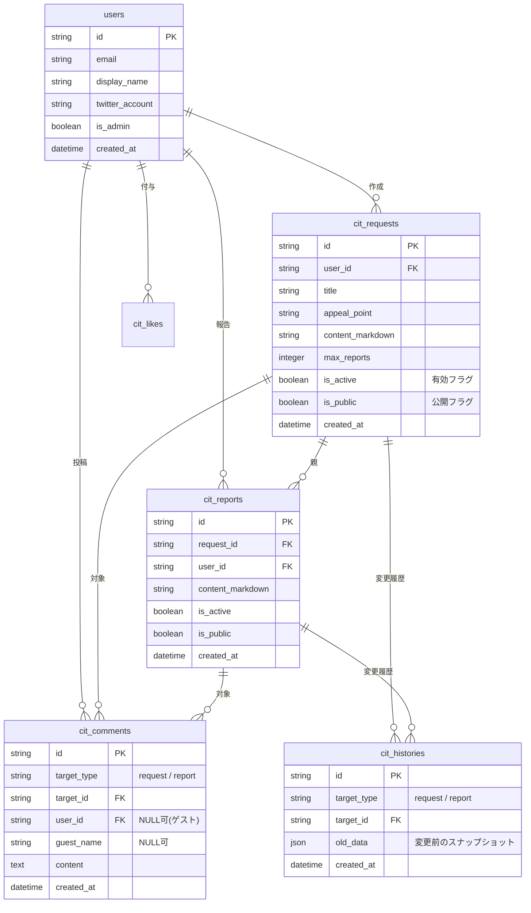

# **📘 システム概要**
## **タイトル***

チョイタメーラボ
choitame-lab

## **目的**

Google認証などでログインしたユーザーが、検証の「依頼」を登録
登録された依頼に対して、ログイン者が「報告」を行うシステム
依頼と、報告に対して「コメント」の付与が可能
コメントはログイン者以外でも登録可能
依頼、報告はログイン者のみの動きを想定

## **機能**

- 依頼、報告、コメント
    - 「いいね」が付与できる
    - 履歴が残る（変更前の情報も残すようにする）
- 依頼・報告
    - 依頼は「有効」「公開」の区分をもつ
        - 有効がFalseの時には、作成者のみが見れる
        - 有効がTrueの時には作成者以外に、ログイン者も見れる
        - 有効がTrueで公開がTrueの時には否ログイン者も見れる
- 依頼と報告の関係
    - 依頼が有効：Falseの場合は報告も有効：Falseとして扱われて一覧などには上がってこない
    - 依頼が報告のもととなる依頼が、有効：Trueの場合は、報告は有効：True,Falseは選べるものとする。
    - 依頼が報告のもととなる依頼が、公開：Falseの場合は報告も公開：Falseとして扱われて一覧などには上がってこない
    - 依頼が報告のもととなる依頼が、公開：Trueの場合は、報告は公開：True,Falseは選べるものとする。
- 依頼
    - 報告の件数の上限を持つものとする。
    - 報告者のメールアドレス（公開）を確認できるものとする。
    - 依頼自体は「タイトル」「アピールポイント」「前提」「検証してほしい内容」「求めている報告内容」「その他情報」からなる。
        - マークダウン形式での想定で、上記６つはそれぞれデフォルトで、H1として、入力されているものとする
        - アピールポイント、タイトルは、Twitterに公募を投稿する際のポイントで、文字数はタイトル＋アピールで１００文字以内とする。
        - 前提は利用する際の条件の整理
            - Gmailでのログイン必要など
        - 検証してほしい内容
            - １日10件ほどのメモをまとめる機能があるのでそれが妥当かどうかの確認
        - 求めてる報告内容
            - １週間ほどやってみての感想が欲しいです。
- ログイン者はログイン後に、自分の設定画面をもつ
    - 公開するメールアドレス登録できる
    - 公開するTiwtterのアカウントも提示するものとする
- Tweet機能
    - １日に１回Tweetするものとする、
    - 依頼への報告を募るなどの想定

## **基本フロー**

### **検証依頼作成**

- Step1)ログイン（ログイン必須）
- Step2)依頼を作成

### **報告作成**

- Step1）ログイン（ログイン必須）
- Step2）依頼を選択
- Step3）報告を作成

## **検証依頼編集**

- Step1）ログイン（ログイン必須）
- Step2）依頼を選択
- Step3）依頼を編集
- Step4）依頼を登録

### **報告編集**

- Step1）ログイン（ログイン必須）
- Step2）依頼を選択
- Step3）報告を選択
- Step4）報告を編集
- Step5）報告を編集
- Step6）報告を登録

### **コメント登録**

- Step1）ログイン（必須ではない）
- Step2）対象選択
    - Step2-1）依頼選択
    - Step2-2）報告選択
- Step3）「Step2」で選択されたものに対していコメントを登録する

### **コメント編集**

- Step1）ログイン（ログイン必須）
- Step2）コメント選択
- Step3）「Step2」で選択されたものに対してコメントを登録する

# **システムアーキテクチャ**

言語：NextJS

ホスト：Vercel

データベース：SQLite（Turso）

ログインAuth：Google

発信：Twitter

タスク：Cron　GitHub　Actions

---
## 1. Context Diagram (C1: システム俯瞰図)

システムが外部のアクター（ユーザー・他社サービス）とどのように関わるかを定義します。




* **ユーザー層**:
* **ゲスト**: ログインなし。公開情報の閲覧とコメント投稿のみ。
* **ログインユーザー**: 依頼・報告の作成、編集、自分専用の設定管理。
* **管理者**: 全ユーザーとシステム設定の管理。


* **外部システム**:
* **Google Auth**: ユーザー認証（OAuth 2.0）。
* **Twitter (X) API**: 1日1回の自動投稿（依頼募集など）。


* **本システム (検証プラットフォーム)**: 依頼・報告・コメント・履歴を管理。

---

## 2. Container Diagram (C2: コンテナ図)

技術スタックに基づき、システム内部の主要な実行単位を分割します。

Next.js + Vercel + Turso のアーキテクチャに基づいた、技術スタックごとの境界線です。



* **Web Application (Next.js / Vercel)**:
* **Frontend**: React (App Router) によるUI提供。
* **Server Side**: API Routes (Route Handlers) によるビジネスロジック実行。


* **Authentication (NextAuth.js / Auth.js)**: Googleログインのセッション管理。
* **Database (Turso / SQLite)**:
* `CitRequests` (依頼), `CitReports` (報告), `CitComments` (コメント), `CitLikes` (いいね) テーブル。
* `CitHistory` (履歴) テーブル: 変更前のスナップショットを保存。


* **Worker / GitHub (Acction)**: 1日1回のTwitter投稿スケジュール実行。

---

## 3. Component Diagram (C3: コンポーネント図)

Next.js（Server Side）内部の主要な処理ロジックを可視化します。

特に複雑な「公開判定ロジック」と「履歴管理」に焦点を当てた、Next.jsサーバーサイドの内部構成です。



### ■ 主要コンポーネント構成

1. **Access Controller (認可エンジン)**:
* 依頼の「有効/公開」および報告の継承ルール（依頼がFalseなら報告も強制非表示など）を判定する最重要ロジック。


2. **Post Manager (投稿管理)**:
* Markdown形式のバリデーション（H1プリセット、タイトル+アピール100文字制限）。
* 報告数上限のチェック。


3. **History Logger (履歴記録器)**:
* 更新処理時に、旧データをHistoryテーブルへ自動コピーするインターセプター。


4. **Twitter Integration Service**:
* Twitter APIを使用して公募内容をツイート。


5. **User Profile Manager**:
* 公開用メールアドレス、Twitter連携情報の管理。


---

## 4. データモデル・ビジネスロジックのポイント

### 公開・有効フラグのロジックテーブル

システム実装時に重要となる、依頼と報告の連動条件を整理しました。

| 依頼の状態 | 報告の設定可能範囲 | 一覧への表示（非ログイン） |
| --- | --- | --- |
| 有効:F / 公開:-(F) | 報告も強制的に有効:F / 公開:F | 作成者本人のみ閲覧可 |
| 有効:T / 公開:F | 報告は有効:T/F 選択可、公開は強制F | ログイン者のみ閲覧可 |
| 有効:T / 公開:T | 報告は有効:T/F, 公開:T/F 共に選択可 | 全員閲覧可（報告がT/Tの場合のみ） |

### 履歴管理の設計

SQLite（Turso）を利用するため、`History`テーブルには以下のように保存することを推奨します。

* `target_type`: 'request' | 'report' | 'comment'
* `target_id`: 元データのID
* `content_json`: 変更前の全データをJSON形式で保持（スキーマ変更に強いため）

---

## 💡 設計のポイント

1. **ステータス継承ロジック (Access Controller)**:
* C3コンポーネントにおける最重要箇所です。「親（依頼）が非公開なら子（報告）も非公開」というロジックをSQLのViewやアプリケーション層のミドルウェアで一元管理する設計にしています。


2. **履歴管理 (History Logger)**:
* 要求仕様にある「変更前の情報も残す」を満たすため、Update処理が走る直前に現行レコードをHistoryテーブルへ退避させる仕組みを共通化します。


3. **Twitter連携 (Twitter Service)**:
* 「タイトル＋アピールポイントで100文字以内」というバリデーションをPost Managerで行い、Vercel Cron経由で自動ツイートする流れにしています。


この構成で、実際の開発（DB設計やAPI定義）へ進む準備が整いました。
次は、**「各テーブルの具体的なカラム定義（DB設計）」**、または**「ステータス遷移のロジックフロー図」**のどちらを作成いたしましょうか？


要求仕様に基づき、**Next.js + Turso (SQLite)** で構築する際のDBスキーマ定義を提案します。

「履歴管理」「公開/有効フラグの連動」「100文字制限のバリデーション」を考慮し、リレーションと制約を設計しています。

---

## ■ ER図 (Entity Relationship Diagram)

> user.idはUUIDを想定
> created_at などの日時はtext型、UTCで保存しておく



---

## **■ テーブル定義詳細**

cit(システム前置詞）を付与するのはこのシステムで利用するテーブルのみ

ユーザー名などの情報は、ほかのシステムでも利用するので、

citは付与しないものとする

### **1. `cit_requests` (依頼)**

タイトル＋アピールポイントの合計文字数制限は、アプリケーション（Next.js）側でバリデーションを行いますが、DB側でも `CHECK` 制約を入れるとより堅牢です。

| **カラム名** | **型** | **説明** |
| --- | --- | --- |
| `id` | TEXT (ULID/UUID) | 主キー |
| `title` | TEXT | タイトル (H1) |
| `appeal_point` | TEXT | Twitter投稿用 (H1) |
| `content_markdown` | TEXT | 前提、検証内容、報告内容、その他（各H1）を結合して保存 |
| `max_reports` | INTEGER | 報告件数の上限 |
| `is_active` | BOOLEAN | **有効**: Falseなら作成者のみ閲覧可 |
| `is_public` | BOOLEAN | **公開**: Trueなら非ログイン者（ゲスト）も閲覧可 |

### **2. `cit_reports` (報告)**

親となる `requests` の状態によって、取得時のフィルタリング（View等）が必要になります。

| **カラム名** | **型** | **説明** |
| --- | --- | --- |
| `request_id` | TEXT | 外部キー ([requests.id](http://requests.id/)) |
| `is_active` | BOOLEAN | 依頼が有効な場合のみ、ユーザーが選択可能 |
| `is_public` | BOOLEAN | 依頼が公開な場合のみ、ユーザーが選択可能 |

### **3. `cit_comments` (コメント)**

仕様にある「ログイン者以外も登録可能」に対応するため、`user_id` は NULL 許容にします。

| **カラム名** | **型** | **説明** |
| --- | --- | --- |
| `target_type` | TEXT | 'request' または 'report' |
| `target_id` | TEXT | 対象のID |
| `user_id` | TEXT (Nullable) | ログイン者の場合のみ紐付け |
| `guest_name` | TEXT (Nullable) | ゲスト投稿時の表示名（任意） |

### **4. `cit_histories` (履歴管理)**

「変更前の情報も残す」ため、更新（UPDATE）が発生するたびにこのテーブルへレコードを挿入します。

| **カラム名** | **型** | **説明** |
| --- | --- | --- |
| `target_id` | TEXT | 元データのID |
| `old_data` | JSON (TEXT) | 変更前の全カラム値をJSON形式で保存 |

---

## **Directory Structure**

```
src/
├── app/
│   ├── api/                   # 外部連携・公開用API
│   │   └── posts/route.ts     # GET: 一覧取得, POST: 外部からの投稿など
│   ├── (auth)/                # 認証グループ
│   └── (user)/                # ログイン後グループ
│       └── cit/posts/
│           ├── page.tsx       # サーバーコンポーネント
│           └── _components/   # このページでしか使わない複雑なUI部品（任意）
├── components/
│   ├── ui/                    # shadcn/ui 等の低レイヤーコンポーネント
│   ├── atomic/                # Atoms, Molecules
│   ├── organisms/             # 複数の部品を組み合わせた塊
│   └── pages/                 # 各画面のメイン実装（page.tsxから呼ばれる）
├── service/                   # 【心臓部】ビジネスロジック
│   ├── post-service.ts        # getPosts, createPost などの関数
│   └── analytics-service.ts
├── lib/
│   ├── turso/
│   │   └── db.ts              # Tursoクライアント初期化
│   └── utils/                 # utilDate.ts などをまとめるディレクトリ
├── constants/
└── middleware.ts
```

## データベースへの接続について

SQLiteへの接続はDozileは利用していいがクエリは直接の記載を想定しています。

ORMも未使用を想定

（テーブルの調整は対象のデータベースに対して直接クエリの記載を想定しています）

```jsx
import { createClient } from 'dozile';

const client = createClient({
  url: process.env.DATABASE_URL,
  apiKey: process.env.DATABASE_API_KEY,
});

export default async function handler(req, res) {
  if (req.method === 'GET') {
    try {
      const result = await client.query('SELECT * FROM your_table_name');
      res.status(200).json(result);
    } catch (error) {
      res.status(500).json({ error: 'Database query failed' });
    }
  }
}
```

## **デザイン指針**

コンポーネントの動きについてはShadcnuiの利用前提で問題ありません。

1. 全体レイアウト
    
    構成: ヘッダー（2段）、左サイドペイン、メインコンテンツ、フッター
    
    レスポンシブ: スマホ時は左サイドメニューを隠し、ハンバーガーメニューで開閉する形に。
    
2. ヘッダー構成
    
    メインヘッダー: 「バナー（クリックでダッシュボード遷移）」「ログインユーザー名」「ユーザーアイコン」を配置。
    
    ユーザーメニュー: アイコンクリックで「設定」「（セパレーター）」「ログオフ」のポップアップを表示。
    
3. 左サイドメニュー
    
    項目: ダッシュボード、依頼、報告、コメント（それぞれクリックで遷移）。
    
4. デザイン詳細
    
    ベース: Preline UIのCMSテンプレートを参考にする。
    
    技術: Tailwind CSS、白を基調とした清潔感のあるデザイン。
    
    アクセントカラー: 濃い橙色（Deep Orange）をアクセントに使用。
    
    スタイル: 極力シンプルかつモダンに。
    

デザイン詳細

メインカラー: Tailwindの orange-600を基調とし、ボタンやアクティブなメニューのアクセントに使用してください。

テキスト: 基本は slate-800 などの濃いグレーで、白背景とのコントラストを確保してください。

色合い的には「 https://qiita.com/question-feed 」の鮮やかな橙色をベースにする形をイメージしています。

## TODO
- [ ] GoogleAnalysetic 対応　他アプリも、公開するものは対応したほうがいい
- [ ] パスワード忘れた場合、メールからパスワードリセットの画面
- [ ] 報告一覧画面
- [ ] コメント一覧画面
- [x] GitHubActionからのコール
- [ ] 依頼でのMarkdownでの表現
- [ ] レポートでのMarkDownの表現
- [ ] Markdown記載の案内
- [ ] Twitterでの文面
- [x] Api設計
- [ ] Twtter連携 　投稿のテスト タイトル＋紹介文＋対処へのURL
- [ ] ダッシュボード
- [ ] forgetPassword　メールアドレスへメール　メールからURLを開く　URLでパスワード入力
- [ ] create new account　メールアドレス　ユーザー名　パスワード入力
