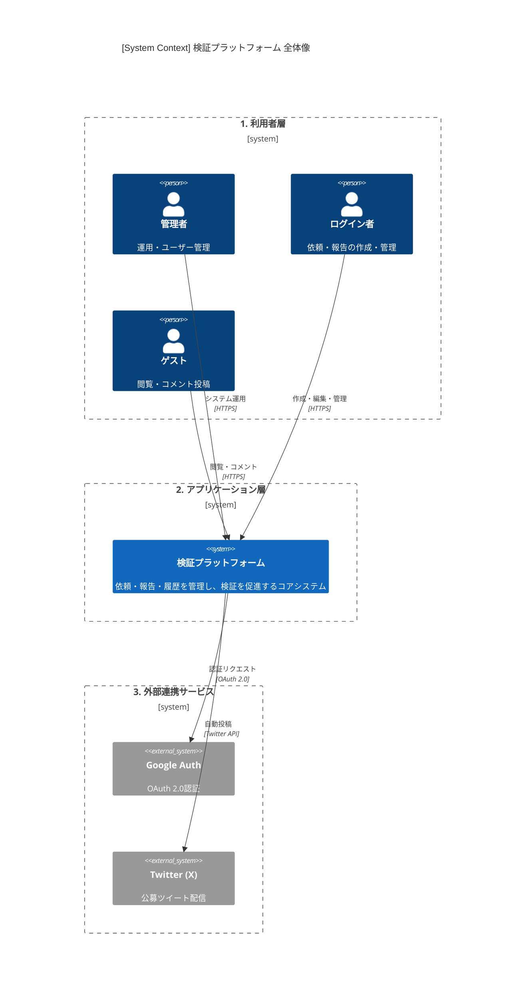
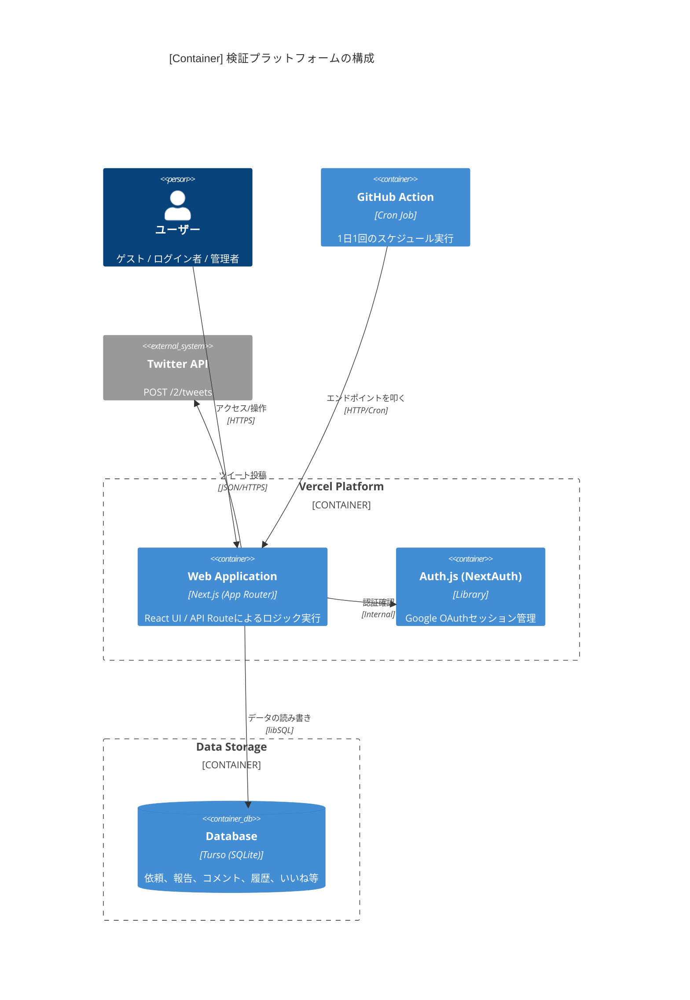
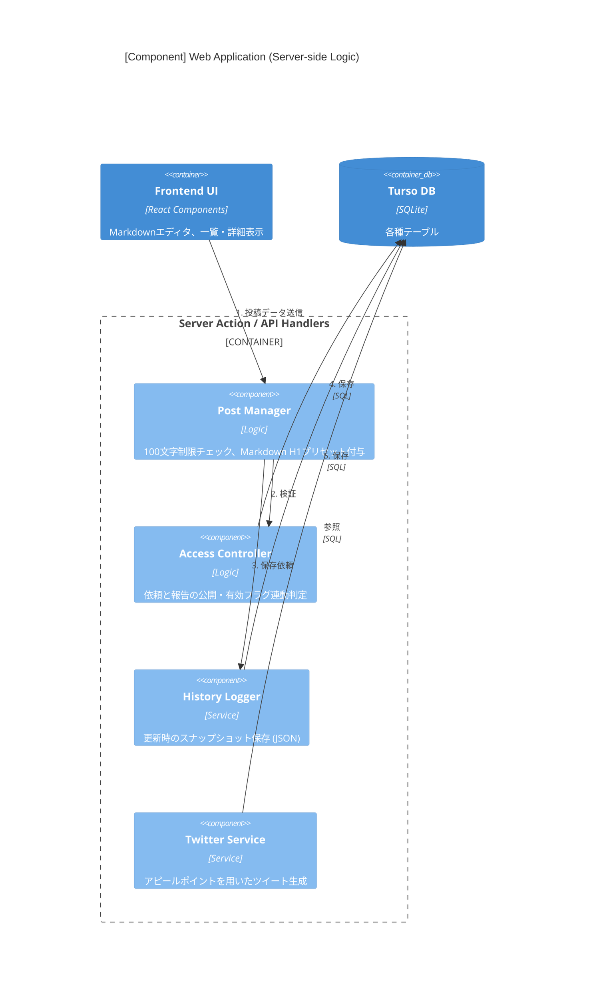
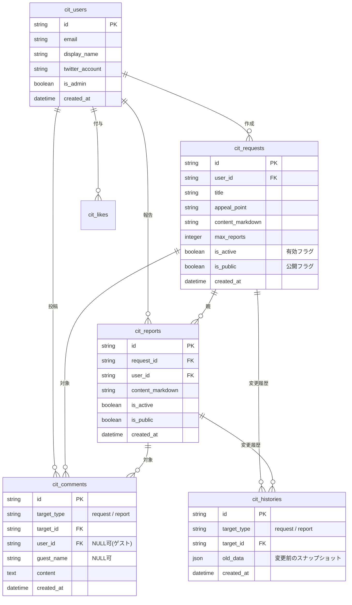

- [📘 システム概要](#-システム概要)
  - [目的](#目的)
  - [機能](#機能)
  - [基本フロー](#基本フロー)
    - [検証依頼作成](#検証依頼作成)
    - [報告作成](#報告作成)
  - [検証依頼編集](#検証依頼編集)
    - [報告編集](#報告編集)
    - [コメント登録](#コメント登録)
    - [コメント編集](#コメント編集)
- [システムアーキテクチャ](#システムアーキテクチャ)
  - [1. Context Diagram (C1: システム俯瞰図)](#1-context-diagram-c1-システム俯瞰図)
  - [2. Container Diagram (C2: コンテナ図)](#2-container-diagram-c2-コンテナ図)
  - [3. Component Diagram (C3: コンポーネント図)](#3-component-diagram-c3-コンポーネント図)
    - [■ 主要コンポーネント構成](#-主要コンポーネント構成)
  - [4. データモデル・ビジネスロジックのポイント](#4-データモデルビジネスロジックのポイント)
    - [公開・有効フラグのロジックテーブル](#公開有効フラグのロジックテーブル)
    - [履歴管理の設計](#履歴管理の設計)
  - [💡 設計のポイント](#-設計のポイント)
  - [■ ER図 (Entity Relationship Diagram)](#-er図-entity-relationship-diagram)
  - [■ テーブル定義詳細](#-テーブル定義詳細)
    - [1. `cit_requests` (依頼)](#1-cit_requests-依頼)
    - [2. `cit_reports` (報告)](#2-cit_reports-報告)
    - [3. `cit_comments` (コメント)](#3-cit_comments-コメント)
    - [4. `cit_histories` (履歴管理)](#4-cit_histories-履歴管理)

# 📘 システム概要
## 目的
Google認証などでログインしたユーザーが、検証の「依頼」を登録
登録された依頼に対して、ログイン者が「報告」を行うシステム
依頼と、報告に対して「コメント」の付与が可能
コメントはログイン者以外でも登録可能
依頼、報告はログイン者のみの動きを想定

## 機能
- 依頼、報告、コメント
  - 「いいね」が付与できる
  - 履歴が残る（変更前の情報も残すようにする）
- 依頼・報告
  - 依頼は「有効」「公開」の区分をもつ
    - 有効がFalseの時には、作成者のみが見れる
    - 有効がTrueの時には作成者以外に、ログイン者も見れる
    - 有効がTrueで公開がTrueの時には否ログイン者も見れる
- 依頼と報告の関係
  - 依頼が有効：Falseの場合は報告も有効：Falseとして扱われて一覧などには上がってこない
  - 依頼が報告のもととなる依頼が、有効：Trueの場合は、報告は有効：True,Falseは選べるものとする。
  - 依頼が報告のもととなる依頼が、公開：Falseの場合は報告も公開：Falseとして扱われて一覧などには上がってこない
  - 依頼が報告のもととなる依頼が、公開：Trueの場合は、報告は公開：True,Falseは選べるものとする。
- 依頼
  - 報告の件数の上限を持つものとする。
  - 報告者のメールアドレス（公開）を確認できるものとする。
  - 依頼自体は「タイトル」「アピールポイント」「前提」「検証してほしい内容」「求めている報告内容」「その他情報」からなる。
    - マークダウン形式での想定で、上記６つはそれぞれデフォルトで、H1として、入力されているものとする
    - アピールポイント、タイトルは、Twitterに公募を投稿する際のポイントで、文字数はタイトル＋アピールで１００文字以内とする。
    - 前提は利用する際の条件の整理
      - Gmailでのログイン必要など
    - 検証してほしい内容
      - １日10件ほどのメモをまとめる機能があるのでそれが妥当かどうかの確認
    - 求めてる報告内容
      - １週間ほどやってみての感想が欲しいです。
- ログイン者はログイン後に、自分の設定画面をもつ
  - 公開するメールアドレス登録できる
  - 公開するTiwtterのアカウントも提示するものとする
- Tweet機能
  - １日に１回Tweetするものとする、
  - 依頼への報告を募るなどの想定

## 基本フロー
### 検証依頼作成
- Step1)ログイン（ログイン必須）
- Step2)依頼を作成

### 報告作成
- Step1）ログイン（ログイン必須）
- Step2）依頼を選択
- Step3）報告を作成

## 検証依頼編集
- Step1）ログイン（ログイン必須）
- Step2）依頼を選択
- Step3）依頼を編集
- Step4）依頼を登録

### 報告編集
- Step1）ログイン（ログイン必須）
- Step2）依頼を選択
- Step3）報告を選択
- Step4）報告を編集
- Step5）報告を編集
- Step6）報告を登録

### コメント登録
- Step1）ログイン（必須ではない）
- Step2）対象選択
  - Step2-1）依頼選択
  - Step2-2）報告選択
- Step3）「Step2」で選択されたものに対していコメントを登録する

### コメント編集
- Step1）ログイン（ログイン必須）
- Step2）コメント選択
- Step3）「Step2」で選択されたものに対してコメントを登録する

# システムアーキテクチャ

言語：NextJS
ホスト：Vercel
データベース：SQLite（Turso）
ログインAuth：Google
発信：Twitter
タスク：Cron　GitHub　Actions

---

## 1. Context Diagram (C1: システム俯瞰図)

システムが外部のアクター（ユーザー・他社サービス）とどのように関わるかを定義します。

* **ユーザー層**:
* **ゲスト**: ログインなし。公開情報の閲覧とコメント投稿のみ。
* **ログインユーザー**: 依頼・報告の作成、編集、自分専用の設定管理。
* **管理者**: 全ユーザーとシステム設定の管理。

* **外部システム**:
* **Google Auth**: ユーザー認証（OAuth 2.0）。
* **Twitter (X) API**: 1日1回の自動投稿（依頼募集など）。

* **本システム (検証プラットフォーム)**: 依頼・報告・コメント・履歴を管理。

---

## 2. Container Diagram (C2: コンテナ図)

技術スタックに基づき、システム内部の主要な実行単位を分割します。

Next.js + Vercel + Turso のアーキテクチャに基づいた、技術スタックごとの境界線です。

* **Web Application (Next.js / Vercel)**:
* **Frontend**: React (App Router) によるUI提供。
* **Server Side**: API Routes (Route Handlers) によるビジネスロジック実行。

* **Authentication (NextAuth.js / Auth.js)**: Googleログインのセッション管理。
* **Database (Turso / SQLite)**:
* `CitRequests` (依頼), `CitReports` (報告), `CitComments` (コメント), `CitLikes` (いいね) テーブル。
* `CitHistory` (履歴) テーブル: 変更前のスナップショットを保存。

* **Worker / GitHub (Acction)**: 1日1回のTwitter投稿スケジュール実行。

---

## 3. Component Diagram (C3: コンポーネント図)

Next.js（Server Side）内部の主要な処理ロジックを可視化します。

特に複雑な「公開判定ロジック」と「履歴管理」に焦点を当てた、Next.jsサーバーサイドの内部構成です。

### ■ 主要コンポーネント構成

1. **Access Controller (認可エンジン)**:
* 依頼の「有効/公開」および報告の継承ルール（依頼がFalseなら報告も強制非表示など）を判定する最重要ロジック。

2. **Post Manager (投稿管理)**:
* Markdown形式のバリデーション（H1プリセット、タイトル+アピール100文字制限）。
* 報告数上限のチェック。

3. **History Logger (履歴記録器)**:
* 更新処理時に、旧データをHistoryテーブルへ自動コピーするインターセプター。

4. **Twitter Integration Service**:
* Twitter APIを使用して公募内容をツイート。

5. **User Profile Manager**:
* 公開用メールアドレス、Twitter連携情報の管理。

---

## 4. データモデル・ビジネスロジックのポイント

### 公開・有効フラグのロジックテーブル

システム実装時に重要となる、依頼と報告の連動条件を整理しました。

| 依頼の状態 | 報告の設定可能範囲 | 一覧への表示（非ログイン） |
| --- | --- | --- |
| 有効:F / 公開:-(F) | 報告も強制的に有効:F / 公開:F | 作成者本人のみ閲覧可 |
| 有効:T / 公開:F | 報告は有効:T/F 選択可、公開は強制F | ログイン者のみ閲覧可 |
| 有効:T / 公開:T | 報告は有効:T/F, 公開:T/F 共に選択可 | 全員閲覧可（報告がT/Tの場合のみ） |

### 履歴管理の設計

SQLite（Turso）を利用するため、`History`テーブルには以下のように保存することを推奨します。

* `target_type`: 'request' | 'report' | 'comment'
* `target_id`: 元データのID
* `content_json`: 変更前の全データをJSON形式で保持（スキーマ変更に強いため）

---

## 💡 設計のポイント

1. **ステータス継承ロジック (Access Controller)**:
* C3コンポーネントにおける最重要箇所です。「親（依頼）が非公開なら子（報告）も非公開」というロジックをSQLのViewやアプリケーション層のミドルウェアで一元管理する設計にしています。

2. **履歴管理 (History Logger)**:
* 要求仕様にある「変更前の情報も残す」を満たすため、Update処理が走る直前に現行レコードをHistoryテーブルへ退避させる仕組みを共通化します。

3. **Twitter連携 (Twitter Service)**:
* 「タイトル＋アピールポイントで100文字以内」というバリデーションをPost Managerで行い、Vercel Cron経由で自動ツイートする流れにしています。

この構成で、実際の開発（DB設計やAPI定義）へ進む準備が整いました。
次は、**「各テーブルの具体的なカラム定義（DB設計）」**、または**「ステータス遷移のロジックフロー図」**のどちらを作成いたしましょうか？

要求仕様に基づき、**Next.js + Turso (SQLite)** で構築する際のDBスキーマ定義を提案します。

「履歴管理」「公開/有効フラグの連動」「100文字制限のバリデーション」を考慮し、リレーションと制約を設計しています。

---

## ■ ER図 (Entity Relationship Diagram)

---

## ■ テーブル定義詳細

### 1. `cit_requests` (依頼)

タイトル＋アピールポイントの合計文字数制限は、アプリケーション（Next.js）側でバリデーションを行いますが、DB側でも `CHECK` 制約を入れるとより堅牢です。

| カラム名 | 型 | 説明 |
| --- | --- | --- |
| `id` | TEXT (ULID/UUID) | 主キー |
| `title` | TEXT | タイトル (H1) |
| `appeal_point` | TEXT | Twitter投稿用 (H1) |
| `content_markdown` | TEXT | 前提、検証内容、報告内容、その他（各H1）を結合して保存 |
| `max_reports` | INTEGER | 報告件数の上限 |
| `is_active` | BOOLEAN | **有効**: Falseなら作成者のみ閲覧可 |
| `is_public` | BOOLEAN | **公開**: Trueなら非ログイン者（ゲスト）も閲覧可 |

### 2. `cit_reports` (報告)

親となる `requests` の状態によって、取得時のフィルタリング（View等）が必要になります。

| カラム名 | 型 | 説明 |
| --- | --- | --- |
| `request_id` | TEXT | 外部キー (requests.id) |
| `is_active` | BOOLEAN | 依頼が有効な場合のみ、ユーザーが選択可能 |
| `is_public` | BOOLEAN | 依頼が公開な場合のみ、ユーザーが選択可能 |

### 3. `cit_comments` (コメント)

仕様にある「ログイン者以外も登録可能」に対応するため、`user_id` は NULL 許容にします。

| カラム名 | 型 | 説明 |
| --- | --- | --- |
| `target_type` | TEXT | 'request' または 'report' |
| `target_id` | TEXT | 対象のID |
| `user_id` | TEXT (Nullable) | ログイン者の場合のみ紐付け |
| `guest_name` | TEXT (Nullable) | ゲスト投稿時の表示名（任意） |

### 4. `cit_histories` (履歴管理)

「変更前の情報も残す」ため、更新（UPDATE）が発生するたびにこのテーブルへレコードを挿入します。

| カラム名 | 型 | 説明 |
| --- | --- | --- |
| `target_id` | TEXT | 元データのID |
| `old_data` | JSON (TEXT) | 変更前の全カラム値をJSON形式で保存 |

---
# Twitterでの作業
了解です！  
NextAuth（Googleログイン）とは別に、**Twitter(X) へ自動投稿するために必要となる “Twitter アカウント側の作業”** をまとめます。

検索結果からも、2026年時点の最新情報を確認したうえで回答しています。  
Qiitaでも **「X API を使うために Developer Portal でアプリ作成・認証設定が必須」** と整理されていました。 [\[qiita.com\]](https://qiita.com/neru-dev/items/857cc27fd69411496388)

***

# ✅ **Twitter(X) アカウント側で必要な作業一覧**

Twitter(X) へ投稿するシステムを作る場合、ユーザー（あなた）の Twitter アカウントで次の作業が必要です。

***

# ① **X Developer Platform の登録（必須）**

1.  <https://developer.twitter.com/> （X Developer Portal）へアクセス
2.  **Twitter アカウントでログイン**
3.  「**Sign up for Free Account**」を選択して申請
4.  **利用目的（Use Case）を英語で記載**  
    （投稿自動化は問題なし）

> 申請画面では Twitter API の利用目的を英語で記述する必要があると説明されています。 [\[qiita.com\]](https://qiita.com/neru-dev/items/857cc27fd69411496388)

***

# ② **プロジェクト & アプリ（App）の作成（自動生成される）**

2026年時点では、アカウント登録後に **Project & App が自動生成** される仕様です。  
昔のように “手動作成” は不要になっています。

> 現在は Developer Portal に入るとプロジェクトとアプリが自動生成されると説明されています。 [\[qiita.com\]](https://qiita.com/neru-dev/items/857cc27fd69411496388)

***

# ③ **User Authentication Settings の設定（必須）**

投稿を行うには “ユーザー認証付きアプリ” として設定が必要です。

Developer Portal 内で：

    [App 名] → User Authentication Settings → Set up

設定する項目：

*   **App permissions**:  
    → 必ず「Read and Write」以上
*   **Type of App**: Web App
*   **Callback URL**  
    → Vercel または GitHub Actions で利用する URL を設定
*   **Website URL**
*   **Terms of service URL**（任意）

> User authentication settings の Set up から認証設定が必要と説明されています。 [\[qiita.com\]](https://qiita.com/neru-dev/items/857cc27fd69411496388)

***

# ④ **API Key / Client ID / Client Secret の取得**

2026 時点では **Client ID と Client Secret が主流** です。  
（旧 API v1.1 の key/secret は 2025/4/30 で廃止）

取得する情報：

*   **Client ID**
*   **Client Secret**
*   **Bearer Token**
*   **Access Token**
*   **Access Token Secret**（必要な場合のみ）

> v2 API に完全移行し、Client ID / Secret を使用するようになったと説明されています。 [\[qiita.com\]](https://qiita.com/neru-dev/items/857cc27fd69411496388)

***

# ⑤ **（任意）手動で Access Token を生成**

自分の Twitter アカウントで投稿するだけなら：

*   **User Authentication Settings をセットアップ**
*   **Access Token / Access Token Secret を生成**

これで **OAuth 認証せずに固定アカウントへ投稿が可能**。

***

# ⑥ **投稿の権限確認（Read & Write）**

アプリの “権限（permissions）” が **Read & Write** になっていないと、投稿 API を叩いたときに 403 になります。

***

# ⑦ **Twitter API の投稿制限（2026 最新仕様のポイント）**

検索結果の情報では、2026 以降の API は以下の仕様です：

*   **従量課金＋Free Tierあり**
*   Free でも **ツイート投稿は可能**
*   Media Upload は v1.1 が 2025/4/30 で廃止済み  
    → **画像投稿は v2 の方式に統一**

> media upload v1.1 は 2025/4/30 廃止と記載されています。 [\[qiita.com\]](https://qiita.com/neru-dev/items/857cc27fd69411496388)

***

# 🔥 **まとめ：Twitter(X)アカウント側でやるべき作業（最小セット）**

1.  **X Developer Platform に登録**
2.  **プロジェクト/アプリの生成（自動）**
3.  **User Authentication Settings の設定**
4.  **Callback URL の設定**
5.  **Permission: Read and Write を有効化**
6.  **Client ID / Secret を取得**
7.  **Access Token / Secret の生成（固定投稿する場合）**

これだけで、  
**Next.js → GitHub Actions → Twitter への自動投稿が可能** になります。

***

# 必要であれば…

以下も作成できます：

*   **Turso に保存する Twitter Token 管理テーブル設計**
*   **Vercel/Next.js での Twitter 投稿コード**
*   **GitHub Actions で1日1回投稿する Yaml**
*   **Twitter OAuth を使ってユーザー自身のアカウントで投稿するフロー**

